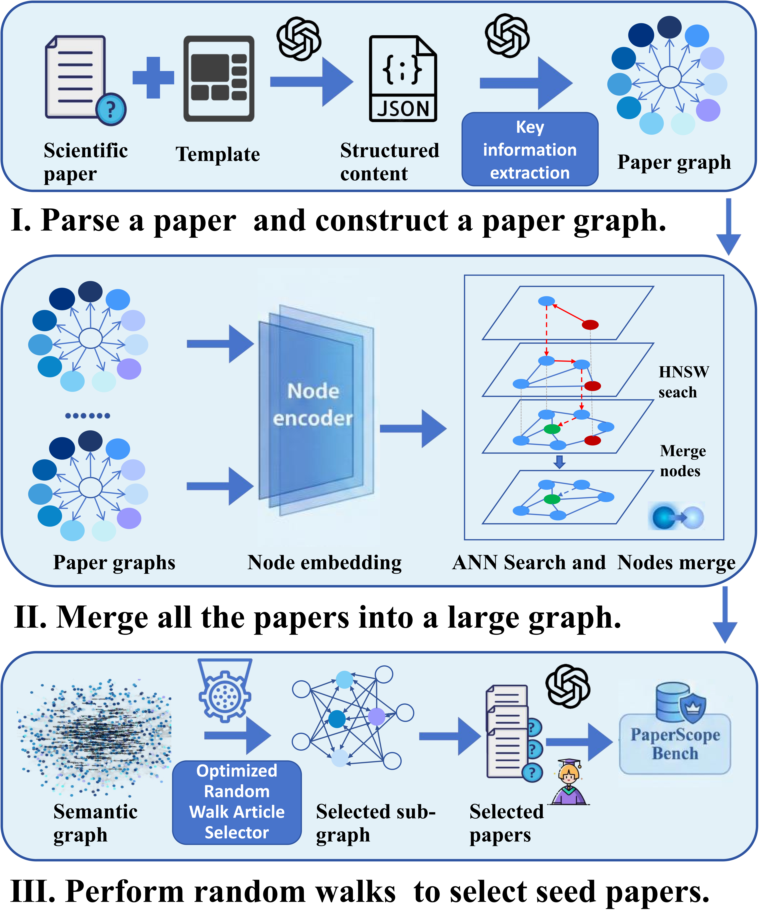
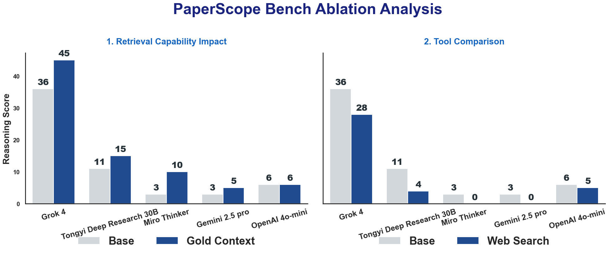

# PaperScope 🔬

<p align="center">
  
  
  
  <a href="https://huggingface.co/datasets/Youxll/PaperScope"></a>
</p>

**PaperScope** 是一个面向智能深度研究的多模态多文档科学推理基准测试平台。它旨在评估多模态大语言模型（MLLMs）在跨文档科学推理任务中的能力，填补了现有单文档理解基准测试的空白。（ACL 2026 Findings）

## 📋 概述

利用多模态大语言模型加速前沿科学研究前景广阔，但如何严格评估此类系统仍不明确。现有基准主要关注单文档理解，而真实的科学工作流程需要整合来自多篇论文的证据，包括文本、表格和图表。因此，多模态、多文档科学推理仍未被充分探索，缺乏系统性评估。

PaperScope 具有以下三大优势：

### 🏗️ 结构化科学基础
基于包含 **2,000+ 篇 AI 论文**（跨越三年）的知识图谱构建，为研究导向的查询提供结构化基础。

### 🔗 语义密集的证据构建
整合语义相关的关键信息节点，采用**优化的随机游走文章选择器**来采样主题一致的论文集，确保充足的语义密度和任务复杂度。

### 📊 多任务科学推理评估
包含 **2,000+ QA对**，涵盖：
- **Reasoning（推理）**：图表比较、算法推理、公式推理等
- **Induction（归纳）**：跨文档信息归纳
- **Summary（摘要）**：多源信息综合摘要
- **Solution（解决方案）**：科学问题求解

## 🏛️ 系统架构

<p align="center">
  
</p>

PaperScope 的数据构建流程分为三个阶段：

### 阶段 I：论文解析与实体提取
1. 将科学论文解析为结构化文档（JSON格式）
2. 利用 LLM 提取论文实体（研究背景、方法论、数据集、结果等 12 种实体类型）
3. 为每篇论文构建论文图（Paper Graph）

### 阶段 II：图合并与节点去重
1. 将所有论文图合并为一个大型语义图
2. 使用节点编码器将节点转换为特征向量
3. 基于 **HNSW 搜索**和**语义相似度**合并相似节点

### 阶段 III：论文选择与QA构建
1. 在大图上执行**优化的随机游走**
2. 选择具有相同实体的多篇文章
3. 以选定的论文作为答案，反向构建 QA 数据

## 📁 项目结构

```
paperscope/
├── doc_parse/                    # 文档解析模块
│   └── doc_parse.py              # PDF论文解析
├── paper_process/                # 论文处理模块
│   ├── paper_lookup.py           # 论文查询工具
│   ├── paper_map_generator.py    # 论文映射生成器
│   └── summary_papers.py         # 论文摘要生成
├── graph_constructor/            # 知识图谱构建模块
│   ├── entity_extractor.py       # 实体抽取器
│   ├── graph_builder.py          # 图构建器
│   ├── optimized_random_walk_selector.py  # 优化随机游走选择器
│   ├── improved_article_selector.py       # 改进的文章选择器
│   ├── performance_monitor.py    # 性能监控
│   └── visualize_graph.py        # 图可视化
├── qa_constructor/               # QA数据构建模块
│   ├── induction_data_constructor/   # 归纳数据构建
│   ├── summary_data_constructor/     # 摘要数据构建
│   └── solution_data_constructor/    # 解决方案数据构建
├── eval/                         # 评估模块
│   └── src/
│       ├── react_agent.py        # ReAct Agent 实现
│       ├── run_evaluation.py     # 评估运行脚本
│       ├── eval_score.py         # 评分系统
│       ├── eval_prompt.py        # 评估提示词
│       ├── tool_filesearch.py    # 文件搜索工具
│       ├── tool_search.py        # 网络搜索工具
│       └── requirements.txt      # 依赖项
└── output/                       # 输出目录
    ├── entities/                 # 提取的实体
    ├── graphs/                   # 构建的图
    ├── selected_papers/          # 选定的论文集
    └── visualizations/           # 可视化结果
```

## 📦 数据集

PaperScope 数据集已发布在 Hugging Face：

🤗 **[Youxll/PaperScope](https://huggingface.co/datasets/Youxll/PaperScope)**

```python
from datasets import load_dataset

# 加载数据集
dataset = load_dataset("Youxll/PaperScope")
```

详细的数据格式说明请参阅 [data/README.md](data/README.md)。

## 🚀 快速开始

### 环境要求

- Python 3.10+
- PyTorch 2.7+
- CUDA 12.x（推荐）
- 至少 32GB GPU 显存（用于大模型推理）

### 安装

```bash
# 克隆仓库
git clone https://github.com/your-repo/paperscope.git
cd paperscope

# 安装依赖
cd eval/src
pip install -r requirements.txt
```

### 环境变量配置

复制 `env.example` 文件为 `.env` 并配置您的 API 密钥和路径：

```bash
cp env.example .env
# 编辑 .env 文件，填入您的配置
```

主要环境变量说明：

| 变量名 | 说明 | 示例 |
|--------|------|------|
| `OPENAI_API_KEY` | OpenAI API 密钥 | `sk-xxx...` |
| `OPENAI_BASE_URL` | API 基础 URL | `https://api.openai.com/v1` |
| `CUDA_VISIBLE_DEVICES` | 使用的 GPU 设备 | `0` 或 `0,1` |
| `VLLM_MODEL_PATH` | 本地 vLLM 模型路径 | `Qwen/Qwen3-32B` |
| `CORPUS_PATH` | 文档语料库路径 | `./doc_parse/output` |

### 主要依赖

| 依赖项 | 版本 | 用途 |
|--------|------|------|
| `vllm` | 0.10.1 | 高效 LLM 推理 |
| `transformers` | 4.56.1 | 模型加载与处理 |
| `faiss-gpu` | 1.7.2 | 向量相似度搜索 |
| `networkx` | 3.4.2 | 图数据结构 |
| `sentence-transformers` | 5.1.2 | 语义嵌入 |
| `qwen-agent` | 0.0.26 | Agent 框架 |

## 📖 使用指南

### 1. 论文处理与实体提取

```bash
# 从论文中提取实体
python graph_constructor/entity_extractor.py \
    --jsonl-dir /path/to/papers \
    --pdf-dir /path/to/pdfs \
    --output /path/to/output/entities.jsonl \
    --use-local  # 使用本地vLLM模型
```

### 2. 构建知识图谱

```bash
# 构建实体图
python graph_constructor/graph_builder.py \
    -i output/entities/extracted_entities.jsonl \
    -o output/graphs \
    --merge_similar \
    --similarity_threshold 0.70 \
    --stopwords stopwords.txt
```

### 3. 优化随机游走选择论文

```bash
# 运行优化的随机游走选择器
python graph_constructor/optimized_random_walk_selector.py \
    -g output/graphs/merged_global_graph.graphml \
    --output_path output/selected_papers/results.jsonl \
    --num_walks 10000 \
    --walk_length 100 \
    --min_common_entities 3 \
    --min_articles 5
```

### 4. 运行评估

```bash
# 启动评估
cd eval/src
bash run_react_infer.sh
```

或使用 Python 脚本：

```bash
python run_evaluation.py \
    --model_path /path/to/model \
    --data_path eval_data/test.jsonl \
    --output_path results/
```

## 📊 实验结果

### 主要评估结果

我们在 PaperScope 上评估了多种先进的 Agent 系统：

| Agent 类型 | 模型 | Reasoning | Induction | Summary | Solution | 总分 |
|-----------|------|-----------|-----------|---------|----------|------|
| **LLM-based ReAct** | WebWatcher 32B | 4 | 0 | 46.74 | 26.78 | 18.70 |
| | OpenAI 4o-mini | 6 | 25.49 | 53.26 | 22.1 | 23.74 |
| | Gemini-2.5-flash-thinking | 7 | 13.33 | 38.40 | 29.71 | 19.32 |
| | OpenAI GPT-5.1 | 0 | 0 | 42 | 51.84 | 17.78 |
| | Gemini 2.5 pro | 3 | 7.02 | 47.54 | 40.39 | 20.50 |
| | GLM 4.5V | 0 | 0 | 37.32 | 32.45 | 14.44 |
| | Kimi k2 | 12 | 24.07 | **56.64** | 49.85 | 30.38 |
| | Qwen3-VL | 4 | 13.33 | 52.74 | 37.38 | 22.89 |
| | deepseek-V3.1 | 6 | **26.32** | 52.22 | 51.65 | 26.46 |
| **Deep Research** | DR Tulu-8B | 4 | 0 | 40.60 | 38.71 | 18.05 |
| | MMSearch-R1-7B | 8 | 3.70 | 43.66 | 17.21 | 19.19 |
| | ASearcher-Web-7B | 13 | 0 | 47.26 | 8.95 | 21.57 |
| | MiroThinker-v1.0-30B | 3 | 3.92 | 27.44 | 32.03 | 13.33 |
| | Tongyi Deep Research 30B | 11 | 0 | 5 | 36.55 | 10.66 |
| | OpenAI o3 deep research | 13 | 0 | 56.26 | **59.15** | 29.29 |
| | **Grok 4** | **36** | 20 | 53.74 | 48.28 | **40.95** |

### 消融实验分析

<p align="center">
  
</p>

#### 1. 检索能力影响 (Retrieval Capability Impact)

比较 Base（无检索）与 Gold Context（提供黄金上下文）的性能差异：

| 模型 | Base | Gold Context |
|------|------|--------------|
| Grok 4 | 36 | 45 |
| Tongyi Deep Research 30B | 11 | 15 |
| Miro Thinker | 3 | 10 |
| Gemini 2.5 pro | 3 | 5 |
| OpenAI 4o-mini | 6 | 6 |

#### 2. 工具比较 (Tool Comparison)

比较 Base 与 Web Search 的性能差异：

| 模型 | Base | Web Search |
|------|------|------------|
| Grok 4 | 36 | 28 |
| Tongyi Deep Research 30B | 11 | 4 |
| Miro Thinker | 3 | 0 |
| Gemini 2.5 pro | 3 | 0 |
| OpenAI 4o-mini | 6 | 5 |

**关键发现**：
- 即使是先进的系统如 OpenAI Deep Research 和 Tongyi Deep Research 在 PaperScope 上也只能取得有限的分数
- 这突显了长上下文检索和深度多源推理的难度
- Gold Context 显著提升了大多数模型的性能，表明检索能力是关键瓶颈

## 📈 评估指标

PaperScope 针对不同任务类型采用不同的评估指标：

| 任务类型 | 评估指标 | 说明 |
|---------|---------|------|
| **Reasoning** | Exact Match | 答案精确匹配 |
| **Induction** | Recall@K, NDCG@K | 检索质量评估 |
| **Summary** | GPT-Score | 多维度评分（流畅度、相关性、准确性、创造性、整体质量） |
| **Solution** | Analysis Score + Technology Score | 分析能力与技术方案评分 |

## 🛠️ 核心组件

### ReAct Agent

基于 Qwen-Agent 框架实现的多轮对话 Agent，支持：
- 工具调用（FileSearchTool, WebSearch 等）
- 思维链推理
- 自动重试机制
- Token 限制管理

### FileSearchTool

基于 Qwen3-Embedding-8B 的文档搜索工具：
- 支持文本、图像和 PDF 文件
- 多模态嵌入检索
- Top-K 相似度搜索

### 知识图谱构建器

- **UnionFind**：用于高效的节点合并
- **HNSW 索引**：近似最近邻搜索
- **语义相似度计算**：基于 Qwen3-Embedding 模型

## 📝 数据格式

### 输入数据格式

```json
{
  "question": "Which method achieves the best performance on ImageNet?",
  "answer": "ViT-Large with 87.3% accuracy",
  "type": "reasoning",
  "sub_task": "Figure-table-chart comparison",
  "source_papers": ["paper1.pdf", "paper2.pdf", "paper3.pdf"]
}
```

### 输出数据格式

```json
{
  "question": "...",
  "answer": "...",
  "prediction": "...",
  "messages": [...],
  "termination": "answer"
}
```

## 🤝 贡献指南

欢迎贡献代码和提出问题！请遵循以下步骤：

1. Fork 本仓库
2. 创建功能分支 (`git checkout -b feature/AmazingFeature`)
3. 提交更改 (`git commit -m 'Add some AmazingFeature'`)
4. 推送到分支 (`git push origin feature/AmazingFeature`)
5. 开启 Pull Request

## 📄 许可证

本项目采用 MIT 许可证 - 详情请参阅 [LICENSE](LICENSE) 文件。

## 📚 引用

如果您在研究中使用了 PaperScope，请引用：

```bibtex
@misc{xiong2026paperscopemultimodalmultidocumentbenchmark,
      title={PaperScope: A Multi-Modal Multi-Document Benchmark for Agentic Deep Research Across Massive Scientific Papers}, 
      author={Lei Xiong and Huaying Yuan and Zheng Liu and Zhao Cao and Zhicheng Dou},
      year={2026},
      eprint={2604.11307},
      archivePrefix={arXiv},
      primaryClass={cs.AI},
      url={https://arxiv.org/abs/2604.11307}, 
}
```

## 🙏 致谢

- [Qwen](https://github.com/QwenLM/Qwen) - 提供基础模型支持
- [Tongyi deepresearch](https://github.com/Alibaba-NLP/DeepResearch) - 提供模型支持和代码借鉴
- [MinerU](https://github.com/opendatalab/MinerU) - PDF 解析引擎
- [Faiss](https://github.com/facebookresearch/faiss) - 向量检索库
- [NetworkX](https://networkx.org/) - 图计算框架

---

<p align="center">
  <b>PaperScope</b> - Advancing Multi-modal Multi-document Scientific Reasoning
</p>

